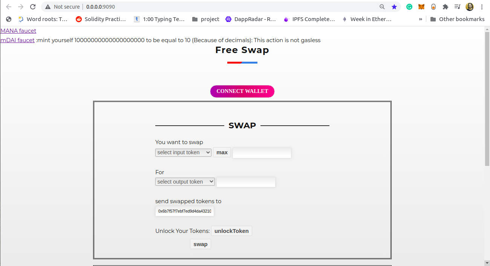
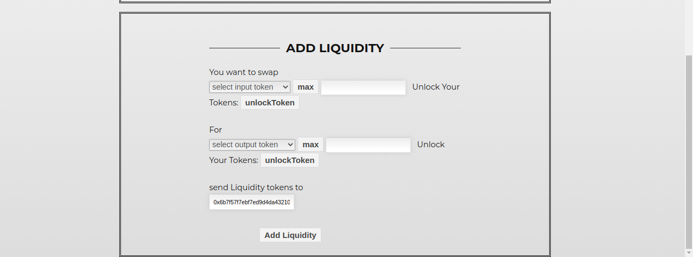

# Free-Swap
Swap without holding ETH(Gas Price) 
Deploy it on ropsten and Ganache.
forked uniswap and added EIP2585 in which used biconomy relayer which call permit function for signe the transaction. 

# Install and run 
1.git clone https://github.com/kalpshah284/Free-Swap.git  
2.add .secret file  
3.npm install  
4.go to src directory  
5.npm run dev 

# Deploy the Contracts 
1. npm install  
2. truffle migrate --network [networkName] (networkName: Ropsten)

# Out put 

